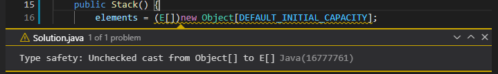
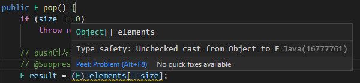

> [결론]
> 
> 제네릭 타입을 사용하면, **클라이언트에서 직접 형변환 하지 않아도 되어 쓰기 편하고 더 안전**하다. 기존 클라이언트에는 아무 영향을 주지 않으면서, 새로운 사용자를 훨씬 편하게 해주는 길이다.

## 제네릭 타입
제네릭 타입은 자바에서 컬렉션과 같은 클래스나 인터페이스를 정의할 때, 타입 파라미터를 사용하여 타입 안정성을 확보하는 방법이다. 즉, 클래스나 인터페이스를 선언할 때 실제 타입이 아닌 타입 매개변수를 사용하여 일반화된 형태로 선언한다.

```java
// 제네릭을 사용하지 않은 ArrayList
List list = new ArrayList();
list.add("Hello");
String item = (String) list.get(0); // 형변환 필요

// 제네릭을 사용한 ArrayList
List<String> list = new ArrayList<>();
list.add("Hello");
String item = list.get(0); // 형변환 필요 없음

```

#### 예시: Object 기반 스택 -> 제네릭 기반 스택
- 컴파일 시점 타입 체크와 불필요한 형변환 제거 등의 이유로 제네릭 타입으로 바꾸는 것이 좋다.
  - 제네릭을 사용하면 컴파일러가 타입 오류를 미리 잡아낼 수 있다.
  - 클라이언트 코드에서의 형변환 번거로움과 오류가능성 감소 
- pop() 메서드에서 객체를 형변환할 때 런타임 오류가 날 위험이 생긴다.

```java
public class Stack {
    private Object[] elements; // => private E[] elements; 클래스 선언에 타입 매개변수를 추가
    private int size = 0;
    private static final int DEFAULT_INITIAL_CAPACITY = 16;

    public Stack() {
        elements = new Object[DEFAULT_INITIAL_CAPACITY]; 
        // => new E[DEFAULT_INITIAL_CAPACITY]; // 예외 발생
        // E 와 같은 실체화 불가 타입으로는 배열을 생성하면 컴파일 에러가 뜬다. (item 28)
    }

    public void push(Object e) { // => Object e -> E e
        elements[size++] = e;
    }
    
    public Object pop() { // => Object -> E
        if (size == 0) {
            throw new EmptyStackException();
        }
        Object result = elements[--size]; // => E result = elements[--size];
        elements[size] = null; // 다 쓴 참조 해제
        return result;
    }
    
    // ...
}

public static void main(String[] args) {
    Stack stack = new Stack();
    stack.push("빵");
    String bread = (String)stack.pop(); // 클라이언트가 객체 형변환 
    // => String bread = stack.pop(); // 형변환 불필요
}

```

## 배열을 사용한 코드를 제네릭으로 만들 수 있는 방법

### 1. 제네릭 배열 생성을 금지하는 제약을 대놓고 우회하는 방법
- Object 배열을 생성한 다음 제네릭 배열로 형변환을 한다

```java
@SuppressWarnings("unchecked")
public Stack() {
    this.elements = new (E[]) new Object[DEFAULT_INITIAL_CAPACITY];
}
```
- 배열을 Object[]로 생성하고 타입변수 배열로 형변환한다.
- 컴파일러는 오류 대신 경고를 내보낸다.
- 비검사 형변환이 안전한지 스스로가 확인해야한다. => 확인 시, @SuppressWarning로 경고 숨김



### 2. elements 필드의 타입을 E[] 에서 Object[] 로 바꾸는 것
- elements의 필드 타입을 E[]에서 Object[]로 바꾼다.

```java
// Object -> 제네릭에서의 절충안 같은 느낌.
public class Stack<E> {
    private Object[] elements;
    private int size = 0;
    private static final int DEFAULT_INITIAL_CAPACITY = 16;

    public Stack() {
        this.elements = new Object[DEFAULT_INITIAL_CAPACITY];
    }

    public void push(E e) {
        elements[size++] = e;
    }

    public E pop() {
        if (size == 0) {
            throw new EmptyStackException();
        }
        @SupressWarnings("unchecked")
        E result = (E) elements[--size]; // 원소를 E(실체화 불가 타입)로 형변환 시키면 형변환이 안전한지 증명할 방법이 없다.
        elements[size] = null;
        return result;
    }
...
}
```



#### 1번 방법 vs 2번 방법
- 1번 방법이 선호되나, 2번 방법이 쓰이기도 한다.
- 1번 선호
  - 가독성: 배열의 타입을 E[]로 선언하여 오직 E타입만 받을 수 있음을 확실한다.
  - 형변환: 1번 방식은 형변환을 배열 생성 시 단 한 번만, 2번은 원소 읽을때마다 형변환
- 2번 선호
  - 런타임 타입과 컴파일 타입이 달라 발생하는 Heap 오염 때문이다.
  - 1번 방법의 경우 컴파일 타입은 Object[]지만 런타임 타입은 E[]이기 때문에 타입이 다른 객체를 참조하여 힙 오염이 발생한다.

### Heap 오염
- 주로 매개변수화 타입의 변수가 타입이 다른 객체를 참조하게 되어, 힙 공간에 문제가 생기는 현상을 의미한다. 
- 즉, 컴파일 중에 정상적으로 처리되며, 경고를 발생시키지 않고 나중에 런타임 시점에 ClassCastException이 발생하는 문제를 나타낸다.
- Heap 오염을 발생시키는 코드 예시
```java
public class Main {
    public static void main(String[] args) {
        // Stack의 Raw 타입 사용
        Stack rawStack = new Stack(); // 타입 파라미터가 없는 상태

        // String 타입 스택으로 처리
        Stack<String> stringStack = rawStack; // rawStack이 Stack<String>으로 캐스팅되었지만, 타입 안정성은 깨진 상태
        
        // Raw 타입으로 Integer 삽입
        rawStack.push(42); // 컴파일 경고 발생 (unchecked warning). 이를 무시하면 Integer가 내부 배열에 삽입

        // String 타입으로 pop 호출
        String value = stringStack.pop(); // 내부적으로 Integer를 반환하려고 하지만, String으로 처리되므로 ClassCastException이 발생
    }
}

```

#### Heap 오염 발생 원인
- Raw 타입 사용: 제네릭 타입의 안전성을 무시하여 타입 안정성을 위반.
  => Raw 타입 사용 금지: 항상 제네릭 타입을 명시적으로 선언
- 배열과 제네릭 혼용: 배열은 공변성을 가지지만, 제네릭은 불공변성을 가지므로 타입 안정성을 깨뜨릴 수 있음.
  => 배열 대신 리스트 사용: E[] 대신 List<E>로 내부 저장소를 구현.
- Unchecked 경고 무시: 컴파일러가 경고를 표시했지만 이를 무시하고 실행.
  => 경고 제거: @SuppressWarnings("unchecked")와 같은 코드 사용을 최소화

#### 해결방안 : Collections.checkedList
- 근본적인 원인을 잡기 위해서는, 꺼낼때가 아닌 넣을 때를 검사해야 한다. 
- 즉, 해당 리스트의 제네릭 타입이 아닌 다른 타입의 요소를 저장할 때 바로 예외를 발생시켜주는 감시자인 Collections.checkedList 사용