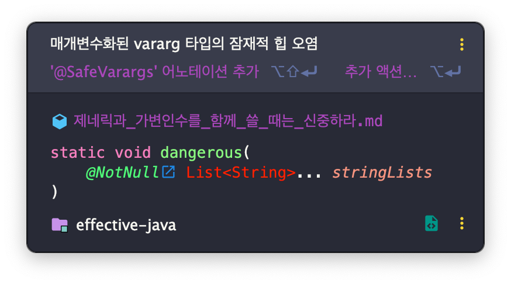

# 제네릭과 가변인수를 함께 쓸 때는 신중하라

## 가변인수와 제네릭이 함께 사용될 때의 허점

> 가변인수(varargs): 메서드에 넘기는 인수의 개수를 클라이언트가 조절할 수 있게 해준다.

가변인수 메서드를 호출하면 가변인수를 담기 위한 배열이 자동으로 하나 만들어지게 된다.
이 배열은 내부로 감춰야 하지만, 클라이언트에 노출하는 문제가 발생할 수 있다.

이로 인해 가변인수 매개변수에 제네릭같은 실체화 불가 타입을 사용하면,
제네릭 타입의 배열이 생성되며, 
제네릭 타입의 배열은 실체화 불가 타입이라 컴파일 시점에 소거되고,
런타임에 체크하기 때문에 `ClassCastException`이 발생할 수 있다.(아이템 28)

그래서 제네릭 타입의 가변인수 매개변수를 사용하면 컴파일러는 경고를 발생시킨다. 

```java
static void dangerous(List<String>... stringLists) {
    List<Integer> intList = List.of(42);
    Object[] objects = stringLists;
    objects[0] = intList; // 힙 오염 발생
    String s = stringLists[0].get(0); // ClassCastException
}
```



이렇듯 제네릭과 가변인수를 함께 사용하면 타입 안전성이 깨진다.
따라서 **제네릭 가변인수 배열 매개변수에 값을 저장하는 것은 안전하지 않다.**

그럼에도 불구하고 제네릭 가변인수 매개변수를 받는 메서드를 선언할 수 있게 한 이유는 무엇일까?
달리 말하면, 경고로 끝내는 이유는 뭘까?

그 답은 제네릭 가변인수 매개변수를 받는 메서드가 실무에서 유용하기 때문이다.

자바에서 제공하는 제네릭 가변인수 매개변수를 받는 메서드

- `Arrays.asList(T... a)`
- `Collections.addAll(Collection<? super T> c, T... elements)`
- `EnumSet.of(E first, E... rest)`

## @SafeVarargs

`@SupressWarnings("unchecked")` 어노테이션을 사용해서 이러한 경고를 숨길 수 있지만,
이렇게 하는 것은 가독성을 떨어뜨리고, 때로는 진짜 문제를 주는 경고마저 숨기는 안 좋은 결과로 이어졌다.

그래서 자바 7에서 `@SafeVarargs` 어노테이션이 추가되어 제네릭 가변인수 메서드에 대한 경고를 숨길 수 있게 되었다.

> `@SafeVarargs` 어노테이션은 메서드 작성자가 그 메서드가 타입 안전함을 보장하는 장치다.

컴파일러는 이 약속을 믿고 그 메서드가 안전하지 않을 수 있다는 경고를 더 이상 하지 않게 된다.

`@SafeVarargs` 어노테이션은 메서드가 안전한 게 확실하지 않다면 절대 사용해서는 안되는 기능이다.

## 메서드가 안전한지는 어떻게 확신할 수 있을까?

제네릭 가변인수 메서드를 호출할 때 생성되는 제네릭 배열에 아무것도 저장하지 않고,
그 배열의 참조가 밖으로 노출되지 않는다면 타입 안전하다고 할 수 있다.

달리 말하면, 호출자로부터 그 메서드로 순수하게 인수들을 전달하는 일만 한다면 그 메서드는 안전하다.

만일 이 중 하나라도 위배된다면, `@SafeVarargs`를 사용해서는 안된다.

> @SafeVarargs 애너테이션은 재정의할 수 없는 메서드에만 달아야 한다.
> 재정의한 메서드도 안절할 지는 보장할 수 없기 때문이다.
> 자바 8에서 이 애너테이션은 오직 정적 메서드와 final 인스턴스 메서드에만 붙일 수 있고,
> 자바 9부터는 private 인스턴스 메서드에도 허용된다.

## 매개변수 배열에 아무것도 저장하지 않고도 타입 안정성을 깰 수 있다.

```java
public static void main(String[] args) {
    String[] attributes = pickTwo("좋은", "빠른", "저렴한");
    System.out.println(attributes);
}

static <T> T[] pickTwo(T a, T b, T c) {
    switch(ThreadLocalRandom.current().nextInt(3)) {
        case 0: return toArray(a, b);
        case 1: return toArray(a, c);
        case 2: return toArray(b, c);
    }
    throw new AssertionError();// 도달할 수 없다.
}

static <T> T[] toArray(T... args) {
    return args;
}
```

이 코드는 컴파일러 경고 없이 컴파일되지만, 런타임에 `ClassCastException`이 발생한다.

### 왜 그럴까?

`pickTwo` 메서드는 제네릭을 담기에 가장 구체적인 타입인 `Object` 배열을 반환한다.
그 후 `Object` 배열로 반환된 `pickTwo` 메서드의 반환값은 `String[]`로 형변환 되는데,
이때 `Object`는 `String`의 하위 타입이 아니므로 형변환에 실패하면서 `ClassCastException`이 발생한다.

이처럼 제네릭 가변인수 매개변수 배열에 다른 메서드가 접근하도록 허용하면 안전하지 않다는 것을 다시 한 번 알 수 있다.

### 단, 예외가 있다.

하지만 예외가 두 가지 있다.

- `@SafeVarargs`로 제대로 애노테이트된 또 다른 가변인수 메서드에 넘기는 것은 안전하다. 
- 배열 내용의 일부 함수를 호출만 하는(가변인수를 받지 않는) 일반 메서드에 넘기는 것도 안전하다.

제네릭 가변인수 매개변수를 안전하게 사용하는 전형적인 예를 들어보겠다.
다음의 `flatten` 메서드는 임의 개수의 리스트를 인수로 받아,
받은 순서대로 그 안의 모든 원소를하나의 리스토로 옮겨 담아 반환한다.

```java
@SafeVarargs
static <T> List<T> flatten(List<? extends T>... lists) {
    List<T> result = new ArrayList<>();
    for (List<? extends T> list : lists) {
        result.addAll(list);
    }
    return result;
}
```

이처럼 제네릭이나 매개변수화 타입의 `varargs` 매개 변수를 받는 모든 메서드에 `@SafeVarargs`를 달아야 한다.

## `@SafeVarargs` 애너테이션이 유일한 정답은 아니다.

아이템 28의 조언을 따라 (실체는 배열인) `varargs` 매개변수를 
`List` 매개변수로 바꿀 수도 있다.

이 방식을 앞서의 `flatten` 메서드에 적용하면 다음처럼 된다.

```java
static <T> List<T> flatten(List<List<? extends T>> lists) {
    List<T> result = new ArrayList<>();
    for (List<? extends T> list : lists) {
        result.addAll(list);
    }
    return result;
}
```

정적 팩터리 메서드인 `List.of`를 활용하면 다음 코드와 같이 이 메서드에 임의 개수의 인수를 넘길 수 있다.

```java
audience = flatten(List.of(friends, romans, countrymen));
```

이렇게 사용하는 게 가능한 이유는 `List.of`에도 `@SafeVarargs` 애노테이션이 달려 있기 때문이다.
이 방식의 장점은 컴파일러가 이 메서드의 타입 안전성을 검증할 수 있다는 데 있다.
작성자가 `@SafeVarargs` 애너테이션을 직접 달지 않아도 되며,
실수로 안전하다고 판단할 걱정도 없다.

단점이라면 클라이언트 코드가 살짝 지저분해지고 속도가 조금 느려질 수 있다는 정도다.

이 방식은 앞서 봤던 `pickTwo` 메서드의 `toArray`처럼 `varargs` 메서드를 안전하게 작성하는 게 불가능한 상황에서도 쓸 수 있다.

```java
public static void main(String[] args) {
    String[] attributes = pickTwo("좋은", "빠른", "저렴한");
    System.out.println(attributes);
}

static <T> T[] pickTwo(T a, T b, T c) {
    switch(ThreadLocalRandom.current().nextInt(3)) {
        case 0: return toArray(a, b);
        case 1: return toArray(a, c);
        case 2: return toArray(b, c);
    }
    throw new AssertionError();// 도달할 수 없다.
}

static <T> T[] toArray(T... args) {
    return args;
}
```

이 `toArray`의 `List` 버전이 바로 `List.of`로, 자바 라이브러리 차원에서 제공하니 직접 작성할 필요도 없다.
이 방식을 `pickTwo`에 적용하면 다음처럼 된다.

```java
public static void main(String[] args) {
    List<String> attributes = pickTwo("좋은", "빠른", "저렴한");
    System.out.println(attributes);
}

static <T> List<T> pickTwo(T a, T b, T c) {
    switch(ThreadLocalRandom.current().nextInt(3)) {
        case 0: return List.of(a, b);
        case 1: return List.of(a, c);
        case 2: return List.of(b, c);
    }
    throw new AssertionError();
}
```

## 정리

가변인수와 제네릭은 궁합이 좋지 않다.
가변인수 기능은 배열을 노출하여 추상화가 완벽하지 못하고,
배열과 제네릭의 타입 규칙이 서로 다르기 때문이다.
제네릭 `varargs` 매개변수는 타입 안전하지는 않지만, 허용된다.
메서드에 제네릭 (혹은 매개변수화된) `varargs` 매개변수를 사용하고자 한다면,
먼저 그 메서드가 타입 안전한지 확인한 다음 `@SafeVarargs` 애너테이션을 달아
사용하는데 불편함이 없게끔 하자.