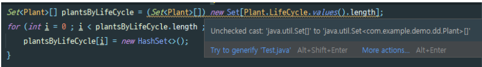

## 결론
> - EnumMap은 내부적으로 배열을 사용하므로 배열의 성능을 유지하면서도, 열거 타입의 타입 안정성을 활용할 수 있다.
> - ordinal 인덱싱 대신 EnumMap을 사용하는 이유
> 	1. **안전성**: `ordinal()`을 인덱스로 사용하는 방식은 가독성이 떨어지고, enum 값의 순서가 변경되면 버그가 발생할 위험이 있음.
> 	2. **성능 최적화**: `EnumMap`은 내부적으로 배열을 사용하여 `HashMap`보다 빠르게 동작.
> 	3. **가독성 향상**: 중첩 `EnumMap`을 활용하면 다차원 관계를 자연스럽고 직관적으로 표현 가능.
> 	4. **Stream과 조합하여 유용**: 데이터를 `EnumMap`으로 변환하는 과정에서 `Stream API`를 적극적으로 활용할 수 있음.

## 예시 클래스

```java
class Plant{  
	enum LifeCycle { ANNUAL, PERENNIAL, BIENNIAL }  
	  
	final String name;  
	final LifeCycle lifeCycle;  
	  
	public Plant(String name, LifeCycle lifeCycle) {  
		this.name = name;  
		this.lifeCycle = lifeCycle;  
	}  
	  
	@Override  
	public String toString(){  
		return name;  
	}  
}
```

## Ordinal()
- ordinal 인덱싱 : 열거형 상수가 선언된 순서에 따라 숫자를 매기는 것을 말한다. 열거형의 첫 번째 상수는 0부터 시작하여 상수가 선언된 순서대로 1씩 증가하는 값을 가지게 된다.
- **배열이나 리스트에서 원소를 꺼낼 때와 같이 인덱싱이 필요할때**는, `ordinal()` 메서드(아이템 35)로 인덱스를 얻을 수 있다.

```java
Set<Plant>[] plantsByLifeCycle = (Set<Plant>[]) new Set[LifeCycle.values().length];  
for (int i = 0 ; i < plantsByLifeCycle.length ; i++) {  
	plantsByLifeCycle[i] = new HashSet<>();  
}  
  
for (Plant plant : garden) {  
	plantsByLifeCycle[plant.lifeCycle.ordinal()].add(plant);  
}  
  
for (int i = 0 ; i < plantsByLifeCycle.length ; i++) {  
	System.out.printf("%s : %s%n", LifeCycle.values()[i], plantsByLifeCycle[i]);  
}

```

#### 해당 코드는 동작은 하지만 ordinal 인덱싱 사용 시, 다음과 같은 문제가 존재한다.
1) 배열은 제네릭과 호환되지 않으니(_아이템 28_) 비검사 형변환을 수행해야 한다.  
     

2) 정확한 정수값을 사용한다는 것을 직접 보증해야 한다. (정수는 타입 안전하지 않음)
   1. `plantsByLifeCycle[plant.lifeCycle.ordinal()].add(plant);`
   2. `System.out.printf("%s : %s%n", LifeCycle.values()[i], plantsByLifeCycle[i]);`
- 타입 안전성 부족: 타입 안전 열거형 패턴을 사용하면 나열한 항목만 사용할 수 있다는 것이 핵심인데, `ordinal()`을 사용하면 이러한 타입 안전성이 보장되지 않는다.
- 유지보수의 어려움: enum의 순서가 변경되면 `ordinal()` 값도 변경되어 버그 발생 가능
- 코드의 가독성 저하: `ordinal()`을 사용하면 코드의 의도를 파악하기 어렵다.

---

## 해결책: EnumMap
- **EnumMap은 열거 타입을 키로 가지며**, **배열과 마찬가지로 실질적으로 열거 타입 상수를 값으로 매핑**하는 일을 한다.
- 참고로 키 타입의 Class 객체는 한정적 타입 토큰으로, 런타임 제네릭 타입 정보를 제공하고 있다.(_아이템 33_)

```java
Map<LifeCycle, Set<Plant>> plantsByLifeCycle = new EnumMap<>(LifeCycle.class);  
  
for (LifeCycle lifeCycle : LifeCycle.values()) {  
	plantsByLifeCycle.put(lifeCycle,new HashSet<>());  
}  
  
for (Plant plant : garden) {  
	plantsByLifeCycle.get(plant.lifeCycle).add(plant);  
}  
  
System.out.println(plantsByLifeCycle);
```


EnumMap을 활용한 코드는 이전 코드와 비교해보면 다음과 같은 장점
> 1) 안전하지 않은 형변환을 쓰지 않는다.
- EnumMap은 enum 타입을 키로 사용하도록 되어있기에 `(Set<Plant>[]) new Set[LifeCycle.values().length]`와 같은 안전하지 않은 형변환이 필요없다.

> 2) 맵의 키인 열거 타입이 그 자체로 출력용 문자열을 제공하니 출력 결과에 직접 레이블을 달 필요 X
- `System.out.println(plantsByLifeCycle);`를 호출하면 각 LifeCycle enum 상수의 이름이 자동으로 키로 사용되어 출력

> 3) EnumMap 내부 구현은 배열 방식이므로 성능이 동일하다.
- EnumMap의 put() 메서드는 내부적으로 enum의 ordinal() 메서드를 호출하여 자연스러운 순서를 유지한다. 이는 이전 코드에서 배열을 직접 사용한 것과 유사한 성능을 제공

---

### 1. EnumMap + Stream 사용 => 코드 줄이기
- 일반적인 `HashMap` 대신 `EnumMap`을 사용하면 **메모리 사용량을 줄이고, 성능을 향상**할 수 있다. 여기에 `Stream API`와 `Collectors.groupingBy()`를 결합하면 **깔끔하고 효율적인 데이터 그룹화** 가능
- `EnumMap`은 내부적으로 배열을 사용하므로 `HashMap`보다 빠르고 메모리 효율적이다.
```java
EnumMap<Plant.LifeCycle, Set<Plant>> lifeCycleSetEnumMap =
		garden.stream().collect(
				groupingBy(
						p -> p.lifeCycle, // LifeCycle 기준으로 그룹화
						() -> new EnumMap<>(Plant.LifeCycle.class), // EnumMap을 사용하여 결과 저장
						toSet() // 같은 LifeCycle을 가진 Plant 객체들을 Set으로 저장
				)
		);

System.out.println("lifeCycleSetEnumMap = " + lifeCycleSetEnumMap);
```


### 2. 중첩 EnumMap : 다차원 관계 표현
- 하나의 `EnumMap`만으로는 **1차원적인 관계**(예: `요일 -> 일정`)만 표현 가능.
- **두 개의 EnumMap을 중첩**하면 **다차원적인 관계**(예: `요일 -> 시간대 -> 일정`)를 표현 가능
- **장점:** 일반 `Map<Map<>>` 구조보다 성능과 타입 안전성이 뛰어나다.
    - EnumMap은 해시 연산 x, O(1)에 가까운 조회, **컴파일 타임에 EnumMap을 강제**
```java
import java.util.EnumMap;  
  
// 요일 Enum 타입  
enum Weekday {  
	MONDAY, TUESDAY, WEDNESDAY, THURSDAY, FRIDAY  
}  
  
// 시간대 Enum 타입  
enum TimeOfDay {  
	MORNING, AFTERNOON, EVENING, NIGHT  
}  
  
public class Main {  
	public static void main(String[] args) {  
		// 중첩 EnumMap 생성 (요일 -> 시간대 -> 일정)
		EnumMap<Weekday, EnumMap<TimeOfDay, String>> schedule = new EnumMap<>(Weekday.class);  
		  
		// 각 요일과 시간대에 해당하는 일정 추가  
		schedule.put(Weekday.MONDAY, new EnumMap<>(TimeOfDay.class));  
		schedule.get(Weekday.MONDAY).put(TimeOfDay.MORNING, "Meeting");  
		schedule.get(Weekday.MONDAY).put(TimeOfDay.AFTERNOON, "Workout");  
		  
		schedule.put(Weekday.TUESDAY, new EnumMap<>(TimeOfDay.class));  
		schedule.get(Weekday.TUESDAY).put(TimeOfDay.MORNING, "Gym");  
		schedule.get(Weekday.TUESDAY).put(TimeOfDay.AFTERNOON, "Study");  
		  
		// 일정 조회 예시  
		String mondayMorningSchedule = schedule.get(Weekday.MONDAY).get(TimeOfDay.MORNING);  
		System.out.println("Monday morning schedule: " + mondayMorningSchedule);  
	}  
}
```
